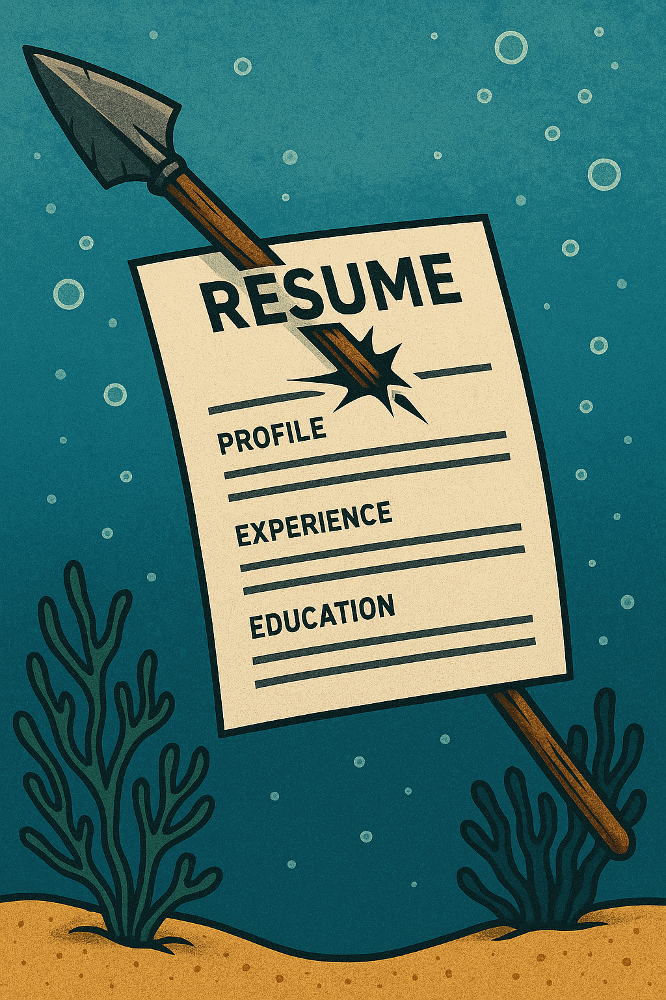
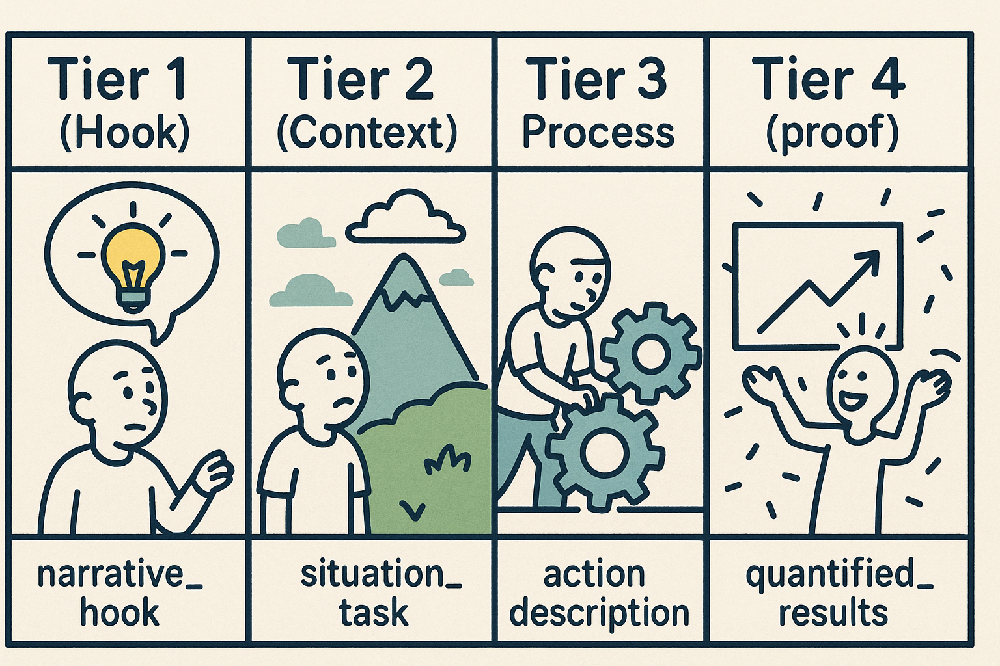

# Spear Resuming - a Fresh AI Perspective

*Unemployeed with too much time on my hands and a resume that says (He's a Problem-solver) - I am using AI to leverage this job hunt*

## Man vs. Machine — Or Man With Machine?

<div>
  
</div>

Man against machine—it can feel like stepping into The Matrix. The system seems stacked against you, scanning, filtering, shutting you out. But here’s the twist: the real power comes when you learn to bend the rules from inside—using AI to outmaneuver AI.

Because today, it’s not just recruiters you need to impress. Your first opponent is often an ATS (Applicant Tracking System)—a digital firewall that scans resumes and filters out up to 88% of applicants before a human ever sees them. That’s exactly where I felt stuck. Until I flipped the script. I stopped seeing AI as the gatekeeper and started using it as my amplifier—building targeted resumes and cover letters that finally broke through.


## "Spear Resuming": The Targeted Approach

<div>
  
</div>

Most resumes are spam: generic, bloated, and destined for the discard pile. But what if you could *spear resume* instead? Precision-targeted applications that read like they were written for one job and one job only.

That’s what I built: a system that takes structured work experience data, fuses it with AI-powered targeting, and produces professional documents that pass the ATS filter and resonate with hiring managers—in minutes, not hours.


## The Problem: Career Documentation Chaos

For years, every job application felt like chaos. I’d dig through old resumes, trying to recall quantified results, patch together phrasing, and end up with inconsistent, stitched-together documents.

Like many engineers, I had decades of rich experience—autonomous vehicles, manufacturing automation, AI, international collaboration—but it was scattered across Word docs, LinkedIn snippets, and fading memories.

The result? Generic applications that neither ATS systems nor recruiters cared about. Worse, I was underselling myself. My resumes often failed to show how I contributed or what measurable impact I delivered. Saying “I worked on Project X” wasn’t enough. Without context and quantified results, it read like filler, not proof. Breaking experiences into Hook, Context, Process, and Proof later made these weaknesses abundantly clear—and showed me exactly which experiences were too weak to include without more work, and which were strong enough to anchor a resume.

That weakness carried into interviews too. I would jump straight into solutions without setting the stage—missing the chance to tell a compelling story of challenge, action, and outcome. And that’s the bigger picture: the problem isn’t just getting a positive reply in your inbox. The real test is the interview room, where you need powerful, structured stories that demonstrate your value. This framework supports that.

I tried off-the-shelf resume tools, but they felt shallow—expensive, generic, and incomplete. If AI was already powering those systems, why couldn’t I build my own version to handle resume customization, cover letter generation, and even interview prep?

---

## The Insight: Work Experience as a Story Framework

<div>
  
</div>

I realized I needed to begin with the end in mind. The goal wasn’t just another cover letter — it was a story powerful enough to carry me through an ATS filter and resonate with a hiring manager.

That shift changed everything. Instead of juggling a cache of slightly different resumes for different jobs, I stepped back and looked at the bigger picture. I needed a story framework for my work history — a structured way to translate raw experience into compelling, reusable building blocks.

Here’s the truth: AI can’t help you if you don’t give it quality input. It’s the classic garbage in, garbage out problem. To get real results, I had to supply clear, well-structured data — not a mess of ad-hoc edits.

So I extracted my qualifications and broke them down into a database of Experiences. Each one became a self-contained, well-defined qualification I could pull from. And to make those Experiences powerful, I built them around four tiers:

Tier 1 (Hook) → narrative_hook: The single biggest win that makes someone want to hire you

Tier 2 (Context) → situation_task: Why this mattered / what made it challenging

Tier 3 (Process) → action_description: Your specific contributions and methods

Tier 4 (Proof) → quantified_results: The numbers that validate your success


## How the 4 Tiers Work

1) NARRATIVE HOOK – Single biggest win that makes someone want to hire you

+--------------------------------------------------------------------------------------+
| 1) NARRATIVE HOOK – Single biggest win that makes someone want to hire you           |
+----------------------+----------------------------------------------------------------+
| Purpose              | One-sentence elevator pitch / cover letter opener (story).     |
| Content              | Role + #1 achievement + scale/context + business impact.       |
| Format               | [Role] + [Action] + [Scale/Context] + [Single Best Outcome].   |
| Constraints          | <30 words; MUST start with a specific role; use business       |
|                      | impact (revenue/market/team scale), not technical metrics.     |
| Example              | Led as Technical Lead MLCC platform generating $30M+ sales     |
|                      | while managing 25-engineer team through market leadership [4]. |
| Note                 | May look redundant, but leading with it gives narrative        |
|                      | control in a cover letter.                                     |
+----------------------+----------------------------------------------------------------+

	

Purpose	One-sentence elevator pitch / cover letter opener (storytelling).
Content	Role + #1 achievement + scale/context + business impact.
Format	[Role] + [Action] + [Scale/Context] + [Single Most Impressive Business Outcome]
Constraints	<30 words; MUST start with a specific role; impact = high-level business outcome (revenue, market leadership, team scale)—not technical metrics.
Example	Led as Technical Lead MLCC platform generating $30M+ sales while managing 25‑engineer team through market leadership achievement [4].
Note	May look redundant, but leading with it gives you narrative control in a cover letter.
2) SITUATION TASK – Why this mattered / what made it challenging

	

Purpose	Set the stage — what challenge needed solving?
Content	Business context, constraints, why it mattered.
Format	The problem/opportunity that required your intervention.
Constraints	No numbers here; save metrics for results. Focus on stakes and difficulty.
Example	Required ground-up development of testing platform following formal V-model processes to achieve market leadership.
3) ACTION DESCRIPTION – Your specific contributions and methods

	

Purpose	The “how” — what you specifically did.
Content	Storytelling with role integrated: methods, processes, decisions, leadership actions.
Format	[Role Context] + Strong Verbs + Specific Actions/Techniques
Constraints	Weave role throughout (e.g., “As Lead Architect…”). No outcomes here; keep results for the next section.
Example	As Principal Engineer, implemented ROS2 architecture [1], designed custom IDL for API generation, led cross-team FMEA analysis sessions.
4) QUANTIFIED RESULTS – The numbers that validate your success

	

Purpose	Measurable proof of success beyond the hook.
Content	Technical metrics, performance improvements, certifications, patents, outcomes.
Format	Specific metrics + context + validation.
Constraints	Include references where available; avoid repeating the #1 business impact already used in the hook.
Example	Produced 9 patents filed with 6 issued [4], achieved 87.5% performance improvement (8→15 fps), obtained TÜV certification, delivered 1M+ devices/hour capability.


### 1) NARRATIVE HOOK – Single biggest win that makes someone want to hire you

* **Purpose**: One-sentence elevator pitch / cover letter opener in a storytelling style.
* **Content**: Role + #1 achievement + scale + business impact.
* **Format**: **\[Role] + \[Action] + \[Scale/Context] + \[Single Most Impressive Business Outcome]**.
* **Length**: One sentence, <30 words.
* **Impact**: High-level business outcome (revenue, market leadership, team scale) — not technical metrics.
* **Example**: **Led as Technical Lead** MLCC platform generating \$30M+ sales while managing 25-engineer team through market leadership achievement \[4].
* **Note**: The hook can sometimes look redundant—but it’s intentional. Your most powerful hook, when aligned with the job you’re applying for, is often the first thing you highlight in a cover letter. Leading with it gives you narrative control: it sets the frame for how the recruiter or hiring manager understands the rest of your story.

### 2) SITUATION TASK – Why this mattered / what made it challenging

* **Purpose**: Set the stage — what challenge needed solving?
* **Content**: Business context, constraints, why it mattered.
* **Format**: The problem/opportunity that required intervention.
* **No numbers**: Save metrics for results.
* **Example**: Required ground-up development of testing platform following formal V-model processes to achieve market leadership.

### 3) ACTION DESCRIPTION – Your specific contributions and methods

* **Purpose**: The “how” — what you specifically did.
* **Content**: Storytelling style with role integrated. Methods, processes, leadership, and technical actions.
* **Format**: **\[Role Context] + Verbs + Actions**.
* **Role Integration**: Weave role throughout — "As Lead Architect, designed...", "Managing team, implemented...", "Working as Senior Engineer, developed..."
* **No outcomes**: Save results for quantified\_results.
* **Example**: **As Principal Engineer**, implemented ROS2 architecture \[1], designed custom IDL for API generation, **led cross-team** FMEA analysis sessions.

### 4) QUANTIFIED RESULTS – The numbers that validate your success

* **Purpose**: Proof of success beyond the hook.
* **Content**: Technical metrics, performance improvements, certifications, patents, outcomes.
* **Format**: Metrics + context + validation.
* **Include references**: Add \[1], \[2] for proven results.
* **Avoid**: Repeating the main business impact already stated in narrative\_hook.
* **Example**: Produced 9 patents filed with 6 issued \[4], achieved 87.5% performance improvement (8→15 fps), obtained TÜV certification, delivered 1M+ devices/hour capability.

---

## Information Hierarchy Rules (Consolidated)

* **Tier 1 (Hook)** → narrative\_hook: Single biggest win that makes someone want to hire you
* **Tier 2 (Context)** → situation\_task: Why this mattered / what made it challenging
* **Tier 3 (Process)** → action\_description: Your specific contributions and methods
* **Tier 4 (Proof)** → quantified\_results: All the numbers that validate your success

## Anti-Redundancy Rules

* Each fact appears in only ONE field
* No metric should be repeated across fields
* Each field should add NEW information
* **narrative\_hook gets the #1 business impact** (revenue, team size, market position)
* **quantified\_results gets all other metrics** (technical performance, certifications, additional outcomes)
* If \$30M revenue is in narrative\_hook, don’t repeat it in quantified\_results


## The Solution: Work Experience as Structured Data

The solution was obvious in hindsight: **treat experience like data.** One living, structured source of truth to generate resumes, cover letters, and interview scripts. No more multiple, conflicting resumes. No more blank-page syndrome. I call it a **Career RAG System**—Retrieval-Augmented Generation, repurposed for career management.

I kept it simple: a YAML file containing a **list** of experiences in a consistent format:

```
experience_id: EXP_XXX # Unique identifier (e.g., EXP_001)
category: [Category Name] # One of: Industry Experience, Core Programming Languages, etc.
primary_skill: [Main Skill] # Primary skill/capability demonstrated
experience_title: [Title] # Concise title for this experience
action_description: [Description] # What you did (past tense, specific actions)
quantified_results: [Results] # Measurable outcomes achieved
role: [Your Role]
proficiency_level: [Expert|Advanced|Intermediate]
keywords: [list]
story_adaptability: [High|Medium|Low]
context:
  company: [Company Name]
  timeframe: [Time Period]
  team_size: [number or null]
situation_task: [Background]
narrative_hook: [One-liner]
tech_stack: [Tools/Frameworks]
```

## The Architecture: YAML + AI = Career Engine

### Core Components

**1. Experience Database** (`work_experience.yaml`)

* 32+ structured entries
* Quantified results, skills, adaptability ratings
* Keywords and tech stacks for ATS and recruiter alignment

**2. Career Timeline** (`work_history.yaml`)

* Company progression, education, certifications
* Resume formatting preferences
* Career-phase summaries

**3. AI-Powered Generation**

* Targeted cover letters with job-description keywords
* Multiple resume formats (ATS-friendly, technical, exec)
* Fit/gap analysis
* Interview prep docs

**Why YAML?**

* Human-readable
* Structured and consistent
* Version-controlled
* AI-ready for parsing

---

## Real-World Results

**Before**

* 2–3 hours per application
* Conflicting resume versions
* Generic targeting
* High ATS rejection rates

**After**

* \~15 minutes per application
* One source of truth
* Tailored, keyword-matched resumes
* Improved pass-through rates

---

## Key Technical Insights

**1. Granularity is everything**

```yaml
- experience_id: EXP_020
  situation_task: "Required autonomous robotic workcell for regression testing..."
  action_description: "Managed 20×20m autonomous ROS-based robotic workcell..."
  quantified_results: "Achieved precision trajectory control in production tests..."
  story_adaptability: High
  keywords: [multi-robot coordination, ROS, autonomous systems]
  tech_stack: [ROS, OptiTrack, LQR controller]
```

**2. Separate content from presentation**

* *Content*: Relevant experiences
* *Formatting*: ATS-safe resumes vs. human-readable design
* *Targeting*: Keyword emphasis for each role

**3. Use AI as filter, not fabricator**
AI doesn’t invent your story—it curates and emphasizes what matters.

---

## Practical Implementation

```bash
# Generate a tailored cover letter
write_cover_letter --job_file=job_desc/Company_Role.md

# Create a role-specific resume
write_resume --target_role="Senior AI Engineer" --format=ats

# Analyze fit and gaps
analyze_fit --job_file=job_desc/Company_Role.md
```

**Evolution**

* v0.1 → simple resume generator
* v0.5 → added cover letter targeting
* v1.0 → full YAML consolidation
* Today → AI-driven with ATS alignment

---

## Lessons Learned

**What Works**

* Quantified results
* Story adaptability scores
* Keyword separation (domain vs. tech tools)
* Git versioning of career progression
* Open-source iteration

**What Doesn’t**

* Over-engineering schemas
* Generic content
* Static templates
* Manual updates

---

## The Bigger Picture: Career as Code

We already version control code, track deployments, automate testing. Why not apply the same discipline to our careers?

* Version-controlled experience DB
* Automated, ATS-proof documents
* Quality metrics & gap analysis
* Continuous integration of new skills

This isn’t just about beating ATS—it’s about engineering your professional story.

---

## Results That Matter

Since adopting this approach:

* 15+ hyper-targeted applications
* Application time cut by 85%
* Higher recruiter response rates
* Authentic, consistent messaging

Even better: structuring my experiences surfaced growth patterns I never noticed before.

---

## Open Source and Next Steps

The system is open here: [AI Cover Letter & Resume Generator](https://github.com/unbedded/ai_coverletter)

**Highlights**

* YAML schema for work experiences
* Claude Code commands
* ATS-safe formatting
* Gap analysis tools
* Docs and examples

**Future Directions**

* Automated interview prep
* Skills tracking over time
* Job board API hooks
* Collaborative filtering for relevance

---

## The Meta Lesson

The act of structuring your experience is **as valuable as the documents themselves**. It’s not just about getting past the firewall—it’s about clarity, credibility, and control in an age where AI stands between you and your next role.

---

## Try It Yourself

1. Start small: structure one project
2. Add numbers: metrics make stories real
3. Iterate your schema for your field
4. Automate step by step
5. Version control everything

You’re not just writing resumes. You’re engineering a system that adapts to the AI age.

---

*How are you navigating the AI disruption in hiring? Have you tried structuring your experiences? I’d love to hear in the comments.*

---

**Tags:** AI · Career Development · RAG · Automation · ATS · Open Source · Future of Work

---

**About the Author**
Spencer Barrett is a systems engineer with 20+ years in robotics, AI-accelerated development, and international collaboration. He believes the future of career success lies in learning to leverage machines—not fight them.

-- *"The one thing worse than having to work - is having to look for a job"* --